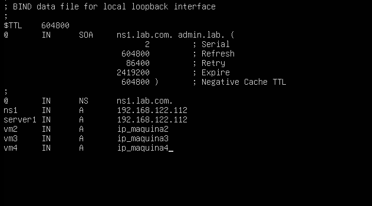
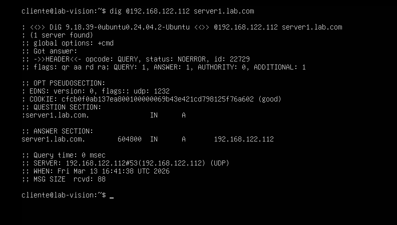

# Laboratório de Servidor DNS Autoritativo (Bind9)🌐
Este repositório contém o passo a passo de um laboratório de infraestrutura focado na implementação e configuração de um servidor DNS privado utilizando o software Bind9 entre máquinas virtuais Linux (Ubuntu Server) em ambiente QEMU/KVM.

### 📋 Objetivos do Lab
 * Instalação e configuração do serviço Bind9.
 * Criação de zona autoritativa para o domínio `lab.com.`
 * Configuração de registros de endereçamento (A) e Servidor de Nomes (NS).
 * Configuração de encaminhadores (Forwarders) para resolução externa.
 * Validação técnica utilizando a ferramenta dig.
### 🛠️ Tecnologias Utilizadas
 * VM Servidor DNS: Ubuntu Server 24.04 LTS
 * VM Cliente: Ubuntu Server 24.04 LTS
 * Virtualização: QEMU/KVM (Virt-Manager)
 * Serviço: Bind9

# 🚀 Execução do Projeto
##  1. Instalação e verificação do Bind9 (Faça no Servidor)
Para instalar o serviço DNS e os utilitários de rede, utilize os seguintes comandos:
```
sudo apt update
sudo apt install bind9 bind9utils bind9-doc -y
```

Pós instalação, verifique se o serviço está ativo:
```
sudo systemctl status bind9
```
O serviço deve constar como "active (running)" como no exemplo abaixo:
Status do Bind9 no Servidor:

**Status do Bind9**


##  2. Configuração de Opções e Forwarders (No Servidor)
Vamos configurar o servidor para que ele saiba o que fazer quando não conhecer um domínio (enviando para o DNS do Google):
```
sudo nano /etc/bind/named.conf.options
```

Localize o bloco forwarders, remova as "#"  e edite para:
```
forwarders {
    8.8.8.8;
    8.8.4.4;
};
```
Esse processo garante que sua rede continue acessando a internet externa.

**Exemplo Bloco Forwarders:**


##  3. Definição da Zona Local (No Servidor)
Agora vamos declarar que este servidor manda no domínio lab.com:
```
sudo nano /etc/bind/named.conf.local
```

Adicione o seguinte bloco:
```
zone "lab.com" {
    type master;
    file "/etc/bind/db.lab.com";
};
```

**Exemplo Bloco Zone:**


##  4. Criação do Banco de Dados de Nomes (No Servidor)
Vamos criar o arquivo que relaciona os nomes aos IPs. Primeiro, copiamos o modelo padrão:
```
sudo cp /etc/bind/db.local /etc/bind/db.lab.com
sudo nano /etc/bind/db.lab.com
```
Essa parte é muito importante pois é aqui onde você irá adicionar os IPs das suas máquinas e os seus nomes de domínios

O arquivo deve ser configurado com o SOA, NS e os registros A conforme o exemplo:

**Registro SOA e NS devem ser configurados com os pontos finais obrigatórios**
```
$TTL    604800
@       IN      SOA     ns1.lab.com. admin.lab.com. (
                              2         ; Serial
                         604800         ; Refresh
                          86400          ; Retry
                        2419200         ; Expire
                         604800 )       ; Negative Cache TTL
;
@       IN      NS      ns1.lab.com.
ns1     IN      A       ip_doserver
server1 IN      A       ip_doserver

```
***Atenção:***
Troque o `ip_doserver` pelo IP da máquina que esta hospedando o servidor, abaixo da linha do `server1` você pode adicionar as suas máquinas

**Exemplo Bloco Registros:**



**Validação do arquivo de zona:**
Sempre verifique se há erros de sintaxe antes de reiniciar:
```
sudo named-checkzone lab.com /etc/bind/db.lab.com
```
Se retornar "OK" esta tudo certo, caso contrario verifique o arquivo

## 5. Validação com o Cliente (Na Máquina Cliente)
Para o teste final, vamos configurar o cliente para usar o IP do nosso servidor no arquivo `/etc/resolv.conf` com o seguinte comando:
```
sudo nano /etc/resolv.conf
```
Vamos configurar o arquivo da seguinte maneira:
```
nameserver ip_doserver
search lab.com
```

**Exemplo da Config:**


Para validar vamos utilizar a ferramenta `dig`
Execução do teste de consulta:
```
dig @ip_do_server server1.lab.com
```

O retorno deve mostrar a ANSWER SECTION com o IP correto do servidor, comprovando que o Bind9 resolveu o nome com sucesso.

**Resultado da consulta via DIG**



##  📝 Conclusão
O laboratório demonstra a importância do DNS na infraestrutura de TI. A transição do uso de IPs brutos para nomes de domínio facilita a administração de sistemas e a escalabilidade da rede, permitindo o gerenciamento centralizado de endereços.
Desenvolvido para fins de estudo em Administração de Sistemas e Infraestrutura Linux.
